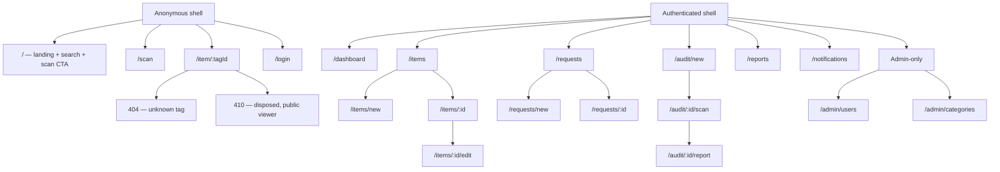

# Frontend Design System
## CNCS Property Management System — Colour, Type, Layout & Component Specification

> **Status: proposal — nothing here is built.** This is the third companion document.
> [`Frontend_Three_Phase_Plan.md`](Frontend_Three_Phase_Plan.md) says **when** things ship,
> [`frontend-plan.md`](frontend-plan.md) says **what** each screen does and which endpoint it
> calls, and **this document says exactly what it looks like and how it behaves at every
> screen size** — colour tokens, type scale, spacing, every core component's states, the
> app's navigation shells, and a page-by-page layout blueprint for mobile and desktop.
>
> **Nothing here overrides a backend rule.** Field visibility (`frontend-plan.md` §5) is
> enforced server-side by `utils/filterItemFields.ts`; this document only styles what the API
> already decided to send. Where a layout depends on a field that may be absent for the
> current viewer, that is called out explicitly in §11.
>
> **Governance:** treat §4–§7 (tokens) the way `CONTRIBUTING.md` treats `schema.prisma` —
> shared and effectively frozen once Phase 1 ships them. A token change is its own PR,
> announced first, because every component and every page in every later phase depends on
> the same palette and scale. See §15.

---

## Table of contents

1. [Design principles](#1-design-principles)
2. [Brand identity](#2-brand-identity)
3. [Color system](#3-color-system)
4. [Typography](#4-typography)
5. [Layout, spacing & breakpoints](#5-layout-spacing--breakpoints)
6. [Iconography](#6-iconography)
7. [Motion, states & interaction rules](#7-motion-states--interaction-rules)
8. [Core component library](#8-core-component-library)
9. [Application shells & navigation](#9-application-shells--navigation)
10. [Page-by-page blueprints](#10-page-by-page-blueprints)
11. [Content & microcopy bank](#11-content--microcopy-bank)
12. [Accessibility checklist](#12-accessibility-checklist)
13. [Responsive QA matrix](#13-responsive-qa-matrix)
14. [Governance](#14-governance)

---

## 1. Design principles

1. **Institutional trust, not decoration.** This is asset-tracking software for a university
   property office. Clarity and accuracy read as more credible than flourish — the frontend
   should look like it belongs to the same careful, rule-following system as the backend it's
   built on.
2. **Mobile-first for the flagship path, desktop-first for the workbench.** The scan → item
   page path (F4) is designed at a 375px viewport first, then grows up. Every staff/admin
   screen is designed for a desk first — that's where the daily data entry happens — but must
   still be fully usable at 375px, because the same admin may approve a request from a
   hallway.
3. **One state, one look, everywhere.** `PENDING` is always the same amber, `DISPOSED` is
   always the same slate, `LOCATION_MISMATCH` is always the same icon. A colour/icon/label
   triple means the same thing in a nav badge, a table row, a detail page, and a toast. No
   screen invents its own variant of an existing status.
4. **Never fake data the API withheld.** A field the server didn't send is absent from the
   layout, not rendered as a placeholder dash or a skeleton stuck loading forever
   (`frontend-plan.md` §5). This document's layouts are built to collapse cleanly around a
   missing field, not leave a hole shaped like one.
5. **Every screen has four designed states: loading, empty, error, content.** A screen that
   only designs the happy path is not done, no matter how good the happy path looks.

---

## 2. Brand identity

> **Superseded.** The open question this section answered — "no logo asset exists" — was
> resolved by the university supplying its own identity: the app now ships AAU's real crest,
> its own Tailwind palette, and Geist Sans, so it reads as part of the same estate as
> `aau.edu.et`. See [`frontend-aau-rebrand.md`](frontend-aau-rebrand.md) for the palette,
> asset provenance and the provenance of every value. The mark, favicon and `theme-color`
> bullets below are **no longer what ships**; the voice bullet still stands.
>
> The original text is kept for context on the decisions that came before:
>
> No logo asset existed in the repository (flagged as an open question in
> `frontend-plan.md` §14). Until the property office supplied one, the system shipped this:

- **Wordmark:** `CNCS` in `font-bold`, `tracking-wide`, brand-700, followed by `Property` in
  `font-normal`, slate-500, same baseline. One lockup, used at every size — don't design a
  second "small" logo.
- **Mark:** a single-colour glyph of two overlapping rounded squares (suggesting a tag on a
  string) — built as inline SVG, not a raster import, so it recolors for print and any future
  dark mode for free, and never needs a CDN request.
- **Favicon:** the mark alone, single colour, transparent background, exported at 32×32,
  180×180 (`apple-touch-icon`), and 512×512 (PWA-style manifest icon, in case a later phase
  adds "Add to Home Screen").
- **`<meta name="theme-color">`:** `--color-brand-600`, so a phone's browser chrome matches
  the app on the scan page — the flagship flow should feel like one continuous surface from
  the OS status bar down.
- **Robots:** `<meta name="robots" content="noindex, nofollow">` in `index.html`. This is an
  internal property register, not a marketing site — a public tag-lookup page existing at a
  guessable URL is a feature (F4), being crawlable and indexable by search engines is not.
- **Voice:** plain, factual, imperative for actions ("Approve request", not "Would you like
  to approve this request?"). API error strings are shown **verbatim**
  (`frontend-plan.md` §4) — the UI must never "improve" or reword what the server said, only
  style its container.

---

## 3. Color system

### 3.1 Foundation

Tailwind CSS is SDS-locked (`frontend-plan.md` §2) and its default palette is already
accessible-by-design at the shade steps used below — so this system **does not invent custom
hex values**. It aliases Tailwind's own scales to semantic names, so implementation is
`bg-brand-600`, not a new hex code to maintain. Hex values are listed for reference (favicon,
`theme-color`, print CSS, anywhere outside Tailwind's class system) and correspond to
Tailwind's `blue`, `slate`, `teal`, `emerald`, `amber`, `orange`, `red`, `violet`, and `sky`
scales.

| Token | Tailwind scale | Base shade | Hex (reference) | Role |
| --- | --- | --- | --- | --- |
| `brand` | `blue` | 600 | `#2563eb` | Primary actions, links, focus ring, active nav |
| `accent` | `teal` | 600 | `#0d9488` | **Reserved for the scan/QR flagship flow only** |
| `neutral` | `slate` | — | `#f8fafc`→`#0f172a` | Backgrounds, borders, body text |
| `success` | `emerald` | 600 | `#059669` | Approved, found, active, good news |
| `warning` | `amber` | 600/700 for text | `#d97706` / `#b45309` | Pending, mismatch, caution |
| `danger` | `red` | 600 | `#dc2626` | Rejected, missing, disposed-as-error states, destructive actions |
| `info` | `sky` | 600 | `#0284c7` | Submitted/FYI notices, informational banners |

**The 50 / 500–600 / 700 rule** — applied to every semantic colour, no exceptions:

| Use | Shade | Example |
| --- | --- | --- |
| Tinted background | `*-50` | Badge fill, banner background |
| Border on a tint | `*-200` | Badge border, banner border |
| Icon / solid fill / button background | `*-500` or `*-600` | Icon colour, filled button |
| Text on white or on a `*-50` tint | `*-700` | Badge label, banner heading |
| Text on a `*-600` solid fill | `white` | Button label |

`warning` is the one scale that needs its darker step for text: `amber-500`/`600` text on a
white background does not clear WCAG AA, so **warning text is always `amber-700`**;
`amber-500` is for icons and fills only. This rule is why the table above lists two shades
for `warning` and one for everything else.

### 3.2 Semantic status maps

These are the only colour/icon pairs that may represent each concept, anywhere in the app —
per Principle 3. Full icon names are in §6.

**Item condition** (`Condition` enum) — reads as a severity ramp, good→bad:

| Value | Badge colour | Icon | Text (`*-700`) |
| --- | --- | --- | --- |
| `NEW` | `accent` (teal) | `Sparkles` | "New" |
| `GOOD` | `success` (emerald) | `ThumbsUp` | "Good" |
| `FAIR` | `warning` (amber) | `AlertTriangle` | "Fair" |
| `DAMAGED` | `orange` | `Wrench` | "Damaged" |
| `BEYOND_REPAIR` | `danger` (red) | `Ban` | "Beyond repair" |

**Item status** (`ItemStatus` enum) — disposal is a normal lifecycle end, not an error, so it
is styled calm, not alarming:

| Value | Badge colour | Icon | Text |
| --- | --- | --- | --- |
| `ACTIVE` | `success`, dot-only (no chip) | `Circle` (filled, small) | "In service" |
| `DISPOSED` | `neutral` (slate-500) | `Archive` | "Disposed" |

**Request status** (`RequestStatus` enum):

| Value | Badge colour | Icon | Text |
| --- | --- | --- | --- |
| `PENDING` | `warning` | `Clock` | "Pending review" |
| `APPROVED` | `success` | `CheckCircle2` | "Approved" |
| `REJECTED` | `danger` | `XCircle` | "Rejected" |

**Audit result** (`AuditItemResult` enum) — deliberately three *different* hues, not a single
ramp, because "found but in the wrong place" is a different kind of problem from "not found,"
not simply a worse or better version of it:

| Value | Badge colour | Icon | Text |
| --- | --- | --- | --- |
| `FOUND` | `success` | `PackageCheck` | "Found" |
| `MISSING` | `danger` | `PackageX` | "Missing" |
| `LOCATION_MISMATCH` | `warning` | `MapPinOff` | "Wrong location" |

**Role** (`Role` enum — remember: **Public is not a role**, it's the absence of a JWT):

| Value | Badge colour | Icon | Text |
| --- | --- | --- | --- |
| `ADMIN` | `violet` | `ShieldCheck` | "Admin" |
| `STAFF` | `brand` | `IdCard` | "Staff" |
| *(anonymous)* | `neutral`, no badge | — | "Guest" (never shown as a role pill) |

**Notification code** (`NOTIFICATION_CODES`, `services/notifications.ts` — a `null` code is a
real, valid state, not a bug: any row not written by the request workflow parses this way):

| Code | Icon colour | Icon | Click target |
| --- | --- | --- | --- |
| `REQUEST_SUBMITTED` | `info` | `FileClock` | `/requests/:relatedRequestId` |
| `REQUEST_APPROVED` | `success` | `CheckCircle2` | `/requests/:relatedRequestId` |
| `REQUEST_REJECTED` | `danger` | `XCircle` | `/requests/:relatedRequestId` |
| `null` | `neutral` | `Bell` | no click target — render as plain text |

### 3.3 Dark mode — tokenized now, shipped later

Dark mode is **not required for MVP** (same cut-scope logic as `/map` and PDF export — see
`Frontend_Three_Phase_Plan.md`). It costs nothing to prepare for, though: every colour above
is consumed through a CSS variable (§3.5), so turning it on later is a `class="dark"` toggle
and a second value block, not a rewrite. If a phase has spare time, this is a safe, contained
"go further" — do not let it delay a P0 screen.

| Token | Light | Dark (reserved) |
| --- | --- | --- |
| `--surface` | `white` | `slate-900` |
| `--surface-alt` | `slate-50` | `slate-800` |
| `--border` | `slate-200` | `slate-700` |
| `--text` | `slate-900` | `slate-100` |
| `--text-muted` | `slate-500` | `slate-400` |
| `--brand-600` | `#2563eb` | `#3b82f6` (one step lighter, for contrast on dark surfaces) |

### 3.4 Contrast rules (non-negotiable)

- Every text/background pairing must clear **WCAG AA**: 4.5:1 for normal text, 3:1 for large
  text (≥24px, or ≥19px bold) and for meaningful icons/borders.
- Colour is never the only signal (already a project rule — restated here as a design
  constraint): every status chip is colour **+ icon + text label**, in that order of
  redundancy, so a colour-blind viewer and a screen-reader user both get the full state.
- Verify token pairings with a contrast checker as part of the Phase 1 accessibility pass
  (§12) before the token file is merged — don't ship an eyeballed guess on a file every later
  phase builds on.

### 3.5 Implementation — CSS variables + Tailwind theme

> **Values superseded.** The block below is the original invented palette. What ships is
> `frontend/src/styles/tokens.css`, whose `brand-*` and `accent-*` are repointed onto
> **Addis Ababa University's own Tailwind theme** — `brand-*` to their `blue` scale (so
> `brand-600` is `#026ca9`, `brand-900` is the `#01324e` footer navy) and `accent-*` to their
> `red`. The structure, the `@theme` mechanism and the self-hosted-font rule below all still
> hold; only the hex values differ. `frontend-aau-rebrand.md` §2 has the authoritative table.
> The font is `@fontsource-variable/geist`, not Inter.

Ship as `frontend/src/styles/tokens.css`, imported once in `main.tsx`. Written for Tailwind
v4's CSS-first `@theme` (if the team pins Tailwind v3 instead, the same values move into
`tailwind.config.ts`'s `theme.extend.colors`, each key pointing at the same CSS variable so
dark mode still works without touching component code).

```css
/* src/styles/tokens.css */
@import "tailwindcss";

@theme {
  /* Brand — Tailwind `blue` */
  --color-brand-50:  #eff6ff;
  --color-brand-100: #dbeafe;
  --color-brand-200: #bfdbfe;
  --color-brand-300: #93c5fd;
  --color-brand-400: #60a5fa;
  --color-brand-500: #3b82f6;
  --color-brand-600: #2563eb;
  --color-brand-700: #1d4ed8;
  --color-brand-800: #1e40af;
  --color-brand-900: #1e3a8a;

  /* Accent — Tailwind `teal` — the scan/QR flow only */
  --color-accent-50:  #f0fdfa;
  --color-accent-100: #ccfbf1;
  --color-accent-500: #14b8a6;
  --color-accent-600: #0d9488;
  --color-accent-700: #0f766e;

  /* Semantic */
  --color-success-50:  #ecfdf5;
  --color-success-100: #d1fae5;
  --color-success-500: #10b981;
  --color-success-600: #059669;
  --color-success-700: #047857;

  --color-warning-50:  #fffbeb;
  --color-warning-100: #fef3c7;
  --color-warning-500: #f59e0b;
  --color-warning-600: #d97706;
  --color-warning-700: #b45309;

  --color-danger-50:  #fef2f2;
  --color-danger-100: #fee2e2;
  --color-danger-500: #ef4444;
  --color-danger-600: #dc2626;
  --color-danger-700: #b91c1c;

  --color-info-50:  #f0f9ff;
  --color-info-100: #e0f2fe;
  --color-info-500: #0ea5e9;
  --color-info-600: #0284c7;
  --color-info-700: #0369a1;

  /* Condition-only extras (not reused elsewhere) */
  --color-orange-500: #f97316;
  --color-orange-600: #ea580c;
  --color-orange-700: #c2410c;
  --color-violet-600: #7c3aed;

  --font-sans: "Inter", ui-sans-serif, system-ui, -apple-system, "Segoe UI", Roboto, sans-serif;
  --font-mono: "JetBrains Mono", ui-monospace, SFMono-Regular, Menlo, Consolas, monospace;
}
```

Load fonts via `@fontsource/inter` and `@fontsource/jetbrains-mono` (self-hosted npm
packages, not a Google Fonts `<link>`) — no render-blocking third-party origin, which matters
on the public scan page loaded over campus wifi.

---

## 4. Typography

| Style | Size / line-height | Weight | Usage |
| --- | --- | --- | --- |
| `display` | 30px / 36px | 700 | Landing hero only — used once in the whole app |
| `h1` | 24px / 32px | 700 | Page title. **Exactly one per page**, matches the browser tab title's main clause |
| `h2` | 20px / 28px | 600 | Section headers within a page |
| `h3` | 16px / 24px | 600 | Card headers, dialog titles |
| `body` | 16px / 24px | 400 | Default body copy, **and the mobile form-input floor** (see rule below) |
| `body-sm` | 14px / 20px | 400 | Secondary text, table cells, helper text |
| `caption` | 12px / 16px | 400 | Timestamps, badge labels, microcopy |

Rules:

- **Every interactive form field is ≥16px (`text-base`) below the `md` breakpoint.** iOS
  Safari auto-zooms the viewport on focusing any input smaller than 16px — a documented,
  easy-to-miss mobile bug that makes a form feel broken on exactly the flagship device class
  this app targets.
- Tag IDs (`CNCS-XXXXXXXX`) are always set in `font-mono`, uppercase, `tracking-wide`. A
  manually-typed tag (F4.1) is compared by eye against a printed sticker — monospacing and
  generous letter-spacing is what makes `0`/`O` and `1`/`I`/`l` tell apart.
- Money and dates inside tables use tabular figures (`font-feature-settings: "tnum"` — Inter
  supports it natively) so a column of numbers aligns on the decimal point instead of
  jittering row to row.
- Never place body text below 14px. `caption` (12px) is for metadata only, never for content
  a user must act on.

---

## 5. Layout, spacing & breakpoints

### 5.1 Spacing scale

Tailwind's default 4px-base spacing scale, unmodified — `1`=4px, `2`=8px, `3`=12px, `4`=16px,
`5`=20px, `6`=24px, `8`=32px, `10`=40px, `12`=48px, `16`=64px. Semantic aliases used
throughout §10:

| Alias | Value | Use |
| --- | --- | --- |
| `gutter-mobile` | `4` (16px) | Page edge padding below `md` |
| `gutter-desktop` | `6`–`8` (24–32px) | Page edge padding at `lg`+ |
| `stack-tight` | `2` (8px) | Between a label and its input, an icon and its label |
| `stack` | `4` (16px) | Between form fields, between list items |
| `section-gap` | `8`–`12` (32–48px) | Between major page sections |
| `card-padding` | `4` mobile / `6` desktop | Inside a card |

### 5.2 Radius & elevation

| Token | Value | Use |
| --- | --- | --- |
| `radius-sm` | 6px | Inputs, chips, badges |
| `radius-md` | 10px | Buttons, cards |
| `radius-lg` | 16px | Modals, the mobile bottom sheet's top corners |
| `radius-full` | 9999px | Avatars, dot indicators, pill badges |
| `e0` | none, border only | Default page surface |
| `e1` | `shadow-sm` | Cards |
| `e2` | `shadow-md` | Dropdowns, popovers |
| `e3` | `shadow-lg` | Modals, toasts — the maximum elevation anywhere in the app |

### 5.3 Breakpoints

Tailwind defaults, used as-is — no custom breakpoints:

| Breakpoint | Width | What changes |
| --- | --- | --- |
| *(base)* | <640px | Single column. Bottom tab bar (authenticated) / stacked CTAs (public). Tables become card lists. Filters collapse into a drawer. |
| `sm` | ≥640px | Item/request card grids go 2-up. Dialogs gain side margin instead of full-bleed. |
| `md` | ≥768px | Forms go 2-column for short fields (floor/room, dateFrom/dateTo). Tables reappear for wider datasets if every column still fits — else stay cards. |
| `lg` | ≥1024px | Sidebar navigation replaces the bottom tab bar. Full data tables. Dashboards go multi-column. |
| `xl` | ≥1280px | Content hits its max width (`5.4`) and centers; extra width becomes margin, not stretched content. |
| `2xl` | ≥1536px | No further layout change — cap, don't stretch. |

### 5.4 Containers

| Context | Max width | Reasoning |
| --- | --- | --- |
| Dashboards, tables, lists | `1280px` (`max-w-7xl`) | Data-dense screens use the space |
| Forms, single-item detail, the public item page | `640px` (`max-w-2xl`) | A form or one item card doesn't need 1280px just because the monitor has it — line length hurts scanability past this |
| Landing hero / search | full-bleed background, `768px` content column | Draws the eye without becoming a wall of white space on ultrawide monitors |

### 5.5 The three application shells

**A — Public / anonymous** (`/`, `/scan`, `/item/:tagId`, `/login`): minimal top bar (mark +
wordmark, a single "Staff Login" ghost button), content, light footer. No sidebar, no bottom
tab bar — an anonymous visitor has exactly one thing to do (find an item), so give them
nothing else to look at.

**B — Authenticated, desktop (`lg`+):** persistent left sidebar + top bar.

```
┌───────────┬─────────────────────────────────────────────────┐
│ ◆ CNCS    │  [breadcrumb / page context]   🔔3  Demo Staff ▾ │
│ Property  ├─────────────────────────────────────────────────┤
├───────────┤                                                   │
│ Dashboard │   Page title (h1)                    [Primary +] │
│ Items     │   ───────────────────────────────────────────    │
│ Requests 2│                                                   │
│ Audits    │   [ content: table / cards / form, max-w-7xl ]   │
│ Reports   │                                                   │
│ Notif's 3 │                                                   │
│ ─────     │                                                   │
│ Admin     │                                                   │
│  Users    │                                                   │
│  Categor. │                                                   │
│ ─────     │                                                   │
│ Sign out  │                                                   │
└───────────┴─────────────────────────────────────────────────┘
  ~240px, fixed              flexible, centered at max-width
```

`Requests` carries the `GET /requests/pending-count` badge for admins; `Notif's` carries
`unreadCount`. "Admin" section renders only for `role: ADMIN` — never rendered-then-hidden by
CSS, simply absent from the DOM for a STAFF session.

**C — Authenticated, mobile (below `lg`):** top bar + bottom tab bar, no sidebar.

```
┌─────────────────────────────┐
│ ◆ CNCS Property     🔔3     │  <- mark + unread bell (tap → /notifications)
├─────────────────────────────┤
│  Page title (h1)              │
│  [Primary action if any]      │
│  ────────────────────────     │
│  [ content, single column ]   │
│                                │
├─────────────────────────────┤
│  🏠     ⬤📷    📦    🧾   ⋯  │  <- Home · Scan(raised) · Items · Requests · More
│ Home   Scan  Items  Requests More │
└─────────────────────────────┘
       respects env(safe-area-inset-bottom) on iOS
```

Five slots, fixed: **Home** (dashboard), **Scan** (raised, `accent`-filled, larger tap target
— the one flagship action gets visual priority even inside the staff app), **Items**,
**Requests** (badge), **More**. "More" opens a full-height sheet listing Audits, Reports,
Notifications (with its own unread badge, duplicated from the top-bar bell so it's reachable
one-handed), Admin (if applicable), Profile, Sign out. This keeps the tab bar at five items —
adding a sixth for "Audits" or "Admin" would shrink every touch target below the 44px minimum
(§12).

---

## 6. Iconography

`lucide-react`, SDS-locked. One icon per concept, used identically everywhere (Principle 3).
Verify each name against the installed package version before wiring it up — the intent
below is unambiguous even if a name shifts release to release.

| Concept | Icon | Concept | Icon |
| --- | --- | --- | --- |
| Search | `Search` | Scan (primary action) | `ScanLine` |
| View a tag / QR | `QrCode` | Filter | `SlidersHorizontal` |
| Menu / close | `Menu` / `X` | Dashboard | `LayoutDashboard` |
| Items (nav) | `Package` | Add item | `PackagePlus` |
| Edit | `Pencil` | Delete / unlink | `Trash2` / `Unlink` |
| Link accessory | `Link2` | Item history | `History` |
| Requests (nav) | `ClipboardList` | New request | `FilePlus2` |
| Approve | `CheckCircle2` | Reject | `XCircle` |
| Pending | `Clock` | Audits (nav) | `ClipboardCheck` |
| Start audit | `PlayCircle` | Found | `PackageCheck` |
| Missing | `PackageX` | Location mismatch | `MapPinOff` |
| Reports (nav) | `FileText` | Download / export | `Download` |
| Print | `Printer` | Notifications | `Bell` / `BellRing` (unread) |
| Admin / users | `Users` | Categories admin | `Tags` |
| Map | `Map` | Building | `Building2` |
| Room / floor | `MapPin` | Condition: New | `Sparkles` |
| Condition: Good | `ThumbsUp` | Condition: Fair | `AlertTriangle` |
| Condition: Damaged | `Wrench` | Condition: Beyond repair | `Ban` |
| Disposed / archived | `Archive` | Role: Admin | `ShieldCheck` |
| Role: Staff | `IdCard` | Camera unavailable | `CameraOff` |
| Torch / flashlight | `Flashlight` | Switch camera | `SwitchCamera` |
| Copy to clipboard | `Copy` → `Check` on success | Sign out | `LogOut` |
| Offline | `WifiOff` | Generic error / warning | `AlertTriangle` |
| Not found (404) | `SearchX` | Health indicator | `Activity` |
| Success toast | `CheckCircle2` | Info toast | `Info` |

---

## 7. Motion, states & interaction rules

- **Durations:** micro-interactions (hover, focus, checkbox toggle) 100ms; component
  transitions (dropdown open, toast in, dialog in) 150–200ms; **no route-level transition
  animation** — a visitor who just scanned a sticker wants the item on screen immediately,
  not after a slide.
- **Easing:** `ease-out` on the way in, `ease-in` on the way out.
- **`prefers-reduced-motion: reduce`:** every transition above collapses to an opacity fade or
  an instant state change. This is not optional polish; wire the media query into the motion
  primitives once, in Phase 1, so no later screen has to remember it.
- **Focus ring:** 2px `brand-600`, 2px offset, on every focusable element, always. Never ship
  `outline: none` without this replacement — that combination is the single most common
  accessibility regression in hand-rolled component libraries.
- **Loading — skeleton vs. spinner, not interchangeable:** a **skeleton** matches the known
  shape of the content about to arrive (item cards, a table, a detail page) and is used for
  every list/detail fetch. A **spinner** is only for an action of unknown duration inside a
  control that already exists (a submit button, a download button) — never for a full page
  whose shape you already know.
- **Hover is a desktop-only enhancement.** Nothing required to complete a task may be
  hover-only — there is no hover on a touchscreen. Every hover-revealed affordance (a table
  row's action icons, say) has a persistent or tap-visible equivalent below `lg`.
- **Confirm before anything irreversible.** Approve, reject, tag regeneration, and filing a
  disposal request each show a confirmation dialog with the specific consequence spelled out
  (§11) — never a bare "Are you sure?". These are exactly the actions a live demo or a
  distracted admin fires by accident.

---

## 8. Core component library

Specified as states and behaviour, not code — implementation is a Phase 1 task
(`Frontend_Three_Phase_Plan.md` §2), this is the contract it builds to.

| Component | Variants / states | Notes |
| --- | --- | --- |
| **Button** | `primary` (brand-600 fill), `secondary` (slate-100 fill), `outline`, `ghost`, `destructive` (danger-600 fill), `link` · sizes `sm`/`md`/`lg` · states default/hover/active/focus/disabled/loading | Loading state swaps the label for a spinner **and** keeps the button's width fixed (no layout jump). Minimum hit target 44×44px on any size below `lg`. |
| **IconButton** | Same variants as Button, square, icon-only | Always carries an `aria-label` — an icon alone is never an accessible name. |
| **Input / Textarea** | default/focus/error/disabled, optional leading icon, optional trailing "clear" | Error state: `danger-600` border + a message below in `danger-700`, referenced by `aria-describedby`. `≥16px` text below `md` (§4). |
| **Select (native)** | Used for closed, small enumerations (Condition, Request type, Audit scope) | Native `<select>` on mobile for the OS picker UX; styled shell on desktop. |
| **Combobox** | Used for open-ended or long lists (Category, Department — see below) | Type-to-filter, but see the **Department picker** note. |
| **DepartmentPicker** | Two modes: *free-entry* (item registration/edit — a combobox that suggests known values but accepts a new one) and *locked* (audit scope — a plain `<select>` restricted to known values, nothing typed) | **Why two modes:** there is no `GET /departments` endpoint (§10.9 gap G9) — `department` is a free-text column. Registration must allow inventing a new department; audit completion requires an **exact, case-sensitive** string match against `Item.department`, so that screen must never accept free text. |
| **CategorySelect** | Populated from `GET /categories` | Real dropdown — that endpoint exists, so no combobox workaround needed here. |
| **Badge / status chip** | One per semantic map in §3.2 | Colour + icon + text, always, per Principle 3. |
| **Avatar** | Initials-only (no avatar upload anywhere in the system) | `radius-full`, background derived deterministically from the user's id so the same person is always the same tint. |
| **Card** | default, interactive (hover elevation on desktop only), disabled/read-only (a disposed item's edit card) | `e1` elevation, `radius-md`. |
| **Table ⇄ ResponsiveList** | One component, two renders | At `lg`+: a real `<table>`. Below `lg`: the same rows render as a stacked card list, one card per row, label:value pairs — **never a horizontally-scrolling table**, which is unusable on a phone held one-handed. |
| **Pagination** | Prev/Next + page indicator (`page`/`totalPages` from the API) | No jump-to-page input — the API's own pages are small enough (`limit` caps at 100) that it isn't worth the extra control. |
| **Tabs** | Underline style, keyboard-navigable (arrow keys) | Used for e.g. item detail (Details / History / Accessories). |
| **Modal / Dialog** | Small (confirm), medium (form) | Focus-trapped, `Esc` closes, click-outside closes (unless a form is dirty — then confirm discard first), returns focus to the triggering element on close. |
| **ConfirmDialog** | A specialised Dialog for irreversible actions | Title states the action, body states the specific consequence (§11 has exact copy), primary button uses `destructive` styling for reject/dispose and `primary` for approve. |
| **Drawer / Bottom sheet** | Slides from the right (desktop filters) or up from the bottom (mobile "More" menu, mobile filters) | Same focus-trap rules as Dialog. |
| **Toast** | `success`/`error`/`info`, auto-dismiss 5s (errors: 8s, or sticky until dismissed for anything needing an action) | Stack cap: 3 visible at once, oldest dismissed first. Every mutation toasts (`frontend-plan.md` §8). **Anything a user can trigger repeatedly in a second must pass an `id`** (`lib/toast.ts` → `ToastOptions`): same id = the newer message *replaces* the older, so a stream of events reads as one line that stays current instead of a column of near-identical toasts. The audit walkthrough is why — one session, one slot (`scanToastSlot`). |
| **Skeleton** | Line, block, card, table-row variants matching real content shapes | See §7. |
| **EmptyState** | Icon + heading + one line of body copy + optional primary action | Copy is specific to *why* the list is empty (§11) — "no items yet" and "no items match these filters" are two different EmptyStates, never the same generic one. |
| **ErrorState** | Sub-variants for `401`, `403`, `404`, `409`, `410`, `500`, and **offline** (network failure, not an HTTP status) | Each renders the server's own `error` string where one exists (§4 of `frontend-plan.md`); `410` and `404` on the item page are the two that must look like designed pages, not a shared generic error box (see §10.2). |
| **StatCard** | Big number + label + optional trend icon | Dashboard only. |
| **ScannerFrame** | Camera viewport with a scan-target overlay, manual-entry field always visible below it, torch/switch-camera controls when supported | See §10.3. |
| **TagStickerCard** | On-screen preview of the printable QR tag | See §10.6 and the print stylesheet below. |
| **NotificationItem** | Icon (from §3.2's code map) + message + relative time + unread dot | Click marks read optimistically and navigates to `relatedRequestId` if present. |
| **NavItem** | Sidebar / bottom-tab / drawer-row renders of the same underlying item list | Active state uses `brand-600` text + a left border (sidebar) or filled icon (bottom tab) — never colour alone (a bold weight change always accompanies it). |
| **HeaderAccountBlock** | The header's account chrome, in two variants: `bar` (one compact trailing control) and `drawer` (identity card + Dashboard + Sign out) | Rendered by **both** shells (`AppLayout`, `PublicLayout`) from `components/aau/HeaderAccountBlock` — the drawer used to differ between them, which made the same hamburger open a different menu depending on the page. One control in the bar, the whole account in the drawer. |
| **SearchBar** | Debounced (300ms), clear button, syncs to the URL query string | Same component on `/`, `/items`, and any admin list. |
| **FilterBar** | Sticky under the page header on desktop, collapses into a Drawer trigger ("Filters · 2") below `lg` | Carries state in the URL, never local-only state (`frontend-plan.md` §7). |
| **PhotoFrame** | Fixed-aspect-ratio (4:3) box around `photoUrl`; shows a category-based placeholder icon on missing/broken URL, `loading="lazy"` | `photoUrl` is a plain URL string with no validation that it resolves (§12 of `frontend-plan.md` doesn't cover broken images) — the placeholder is what stops a dead link from becoming a broken-image icon in the middle of a card. |

---

## 9. Application shells & navigation

### 9.1 Role-aware navigation matrix

The exact set of destinations rendered per viewer — absent from the DOM for a role that can't
use them, never merely disabled (Principle from `frontend-plan.md` §8: "nav renders only
routes the role can use"):

| Destination | Anonymous | Staff | Admin |
| --- | --- | --- | --- |
| `/` , `/scan`, `/item/:tagId` | ✅ | ✅ | ✅ |
| `/login` | ✅ (redirects away once authenticated) | – | – |
| `/dashboard` | – | ✅ | ✅ |
| `/items`, `/items/new`, `/items/:id`, `/items/:id/edit` | – | ✅ | ✅ |
| `/requests*` | – | ✅ (own requests; no approve/reject buttons) | ✅ (full queue + decide) |
| `/audit/*` | – | ✅ | ✅ |
| `/reports` | – | ✅ | ✅ |
| `/notifications` | – | ✅ | ✅ |
| `/admin/users`, `/admin/categories` | – | – | ✅ |
| `/map` (if shipped) | ✅ | ✅ | ✅ |

A Staff account that deep-links to `/admin/users` gets the app's normal 404 — not a "you don't
have permission" page. Per `frontend-plan.md` §5's rule ("never hide instead of enforce"),
inventing a 403 page for an admin-only *frontend route* would be pure UI theatre with no
backend check behind it (`POST /auth/register` already 403s server-side); a 404 keeps the
number of trust boundaries the UI pretends to enforce at zero.

### 9.2 Sitemap



---

## 10. Page-by-page blueprints

Reference viewports: **mobile 375×812** (iPhone SE/12/13-mini class — the narrowest realistic
target), **desktop 1280×800**. Every screen below inherits the shell from §9 (A/B/C) unless
noted; only the content region is drawn.

### 10.1 `/` — Landing (Shell A)

**Purpose:** find an item, fast, with zero training (SRS usability requirement).

Mobile:

```
┌─────────────────────────────┐
│ ◆ CNCS Property   Staff → │
├─────────────────────────────┤
│                              │
│  Find a campus asset         │  h1
│  Scan a tag or search below  │  body, slate-600
│                              │
│ ┌──────────────────────────┐ │
│ │  ▣  Scan a tag            │ │  accent-600 fill, 56px tall, full width
│ └──────────────────────────┘ │
│           — or —              │
│ ┌──────────────────────────┐ │
│ │ 🔍 Search name or tag ID  │ │
│ └──────────────────────────┘ │
│ [ Department ▾ ]  [Category▾]│  wraps to 2 rows if needed
│                              │
│ Recently added                │
│ ┌──────────────────────────┐ │
│ │ [photo] Dell Latitude…    │ │  1 card per row
│ │ CNCS-DEMO-0001 · [GOOD]   │ │
│ └──────────────────────────┘ │
│  … (skeleton while loading)   │
├─────────────────────────────┤
```

Desktop: same content, centered at `max-w-2xl` for the hero + search, then the result grid
widens to 3–4 columns at `max-w-7xl`. The "Scan a tag" button sits beside the search bar
rather than stacked above it.

States: skeleton cards on first load; **empty** ("No items match these filters" +a "Clear
filters" action) is distinct from **zero items in the whole system** ("No items registered
yet" — realistically only seen against a freshly-seeded database); network error shows the
`ErrorState` offline variant if `navigator.onLine` is false, otherwise the generic `500`
variant.

### 10.2 `/item/:tagId` — the QR destination (Shell A, or Shell B chrome if signed in)

**This is the highest-traffic, highest-stakes screen in the system.** It has exactly three
outcomes and each is a fully designed page, not a shared error box:

1. **Found, viewer sees N fields** — render *only* the keys present in the response
   (Principle 4). Layout groups: header (photo, name, tag ID in mono, condition badge),
   location block (department/building/floor/room — always public per SRS 3.4), then,
   *only if present in the payload*, an owner block, a value block, a specs block
   (brand/model/serial), notes, and an accessories list. A public viewer's page is therefore
   visibly shorter than a staff viewer's — that difference **is** the access control, not a
   bug to visually patch over.
2. **`404`** — "Tag not found." + the raw tag ID that was looked up + a manual-search
   fallback. Icon `SearchX`. Same visual weight as a normal page, not a browser-default error.
3. **`410`** disposed, public viewer only — renders **only** the API's exact sentence, `"This
   item is no longer in service"`, plus the `Archive` icon, calm slate styling (this is a
   normal lifecycle end, not a red alarm), and nothing else — no tag ID, no name, per F7.3's
   "nothing else." A signed-in staff/admin viewer never sees this state; they get outcome 1
   with the full disposed record (status badge = "Disposed").

Mobile layout for outcome 1 (staff/admin viewer shown; a public viewer is the same layout with
the owner/value/specs/notes/accessories/history blocks simply not present):

```
┌─────────────────────────────┐
│ ◆ CNCS Property     🔔3     │
├─────────────────────────────┤
│  ┌───────────────────────┐  │
│  │      [photo 4:3]        │  │  PhotoFrame, placeholder if none/broken
│  └───────────────────────┘  │
│  Dell Latitude Laptop         │  h1
│  CNCS-DEMO-0001  [GOOD]       │  mono tag id + condition badge
│  [In service]                 │  item status
│                                │
│  Location                      │  h2
│  Computer Science · CNCS Building · Floor 3 · Room 312
│                                │
│  Owner  (staff/admin/owner only)
│  Demo Staff                    │
│                                │
│  Value  (staff/admin/owner only)
│  Purchase: ETB 45,000.00        │
│                                │
│  Specs (staff/admin/owner only)
│  Dell · Latitude 5420 · S/N —   │
│                                │
│  Notes (if present)             │
│                                │
│  Accessories (if any)           │
│  • Dell 65W Charger — CNCS-DEMO-0004
│                                │
│  [Tabs: Details | History]  (staff/admin — History is ❌ for the owner too, SRS 3.4)
│                                │
│  (staff/admin) [Edit] [View tag] [File request]
└─────────────────────────────┘
```

Desktop: two-column — photo + quick actions in a left rail (`~360px`), the field groups in a
right column, `max-w-2xl` for the whole content block so long specs don't stretch into an
unreadable line length.

Interaction detail: a **Copy** icon next to the tag ID copies it (and, on the staff/admin
view, a second control copies the shareable public link) — small, cheap, genuinely useful when
someone needs to paste a tag ID into a request or an email.

### 10.3 `/scan` (Shell A)

Camera-first, manual entry always visible — never behind a "having trouble?" toggle
(F4.1 requires both to resolve to the same destination):

```
┌─────────────────────────────┐
│ ◆ CNCS Property             │
├─────────────────────────────┤
│  Scan a tag                   │  h1
│ ┌───────────────────────────┐│
│ │  ┌─────────────────────┐  ││
│ │  │                       │ ││  live camera viewport
│ │  │   ⌐ scan-target ⌐    │ ││  corner-bracket overlay, accent-600
│ │  │                       │ ││
│ │  └─────────────────────┘  ││
│ │        🔦        🔄       ││  torch / switch-camera, if supported
│ └───────────────────────────┘│
│         — or type it —         │
│ ┌───────────────────────────┐ │
│ │ CNCS-________            →│ │  mono input, auto-uppercase, submit on Enter
│ └───────────────────────────┘ │
└─────────────────────────────┘
```

- **Camera unavailable** (no secure context, permission denied, no camera hardware): the
  camera panel is replaced — not just blanked — by a `CameraOff` icon and one sentence
  explaining *why* ("Camera access needs a secure connection (HTTPS or localhost)." /
  "Camera permission was denied — you can still type the tag ID below."), so this reads as a
  permission/environment issue, never as a broken app (`frontend-plan.md` §7 flags this
  exact failure mode as a demo-day risk).
- **Zoom belongs to the camera, not the page.** A range control sits under the viewport and
  re-constrains the video track — the only zoom that helps you aim a phone at a sticker — and it
  renders only when the running camera reports a real zoom range. Most iPhones expose none, and a
  missing control is honest where a dead one is not. The viewport itself opts out of page-level
  pinch-zoom (`touch-action: pan-x pan-y`, set as an arbitrary property so it does not depend on
  utility order), because pinching over the video used to scale the whole document and slide the
  manual-entry field off the screen mid-scan. Page scrolling under the viewport still works.
- A successful decode gets a brief `accent`-coloured flash + haptic-feeling toast before
  navigating to `/item/:tagId` — enough feedback that the user trusts the scan registered
  before the page changes underneath them.
- Desktop: identical layout, centered at `max-w-md` — this screen is designed once, for a
  phone, and desktop simply constrains its width rather than "expanding" a phone-shaped task.

### 10.4 `/dashboard` (Shell B/C)

Quick orientation, not a data dump:

```
Desktop (grid, max-w-7xl):
┌───────────────┬───────────────┬───────────────┐
│ Pending review │ Items tracked │ Audits run     │  StatCards
│      2         │     153       │      4         │
├───────────────┴───────────────┴───────────────┤
│ [+ Register item]  [Start an audit]  [View requests] │  primary shortcuts row
├─────────────────────────────────────────────────┤
│ Needs your review (admin) / Your recent requests (staff) │
│  … up to 5 rows, "View all →" to /requests        │
└─────────────────────────────────────────────────┘
```

Mobile: StatCards become a horizontally-scrollable row of 3 (not stacked — three numbers are
worth a swipe, not three full-width screens), shortcuts stack as full-width buttons, the
requests preview list uses the ResponsiveList card pattern.

### 10.5 `/items` (browse/manage, Shell B/C) & item cards

`GET /items?page=&limit=&search=&categoryId=&department=`. FilterBar (SearchBar +
CategorySelect + DepartmentPicker in free-entry mode used as a filter, not a write) all
URL-synced. Grid of cards below `lg` (2-up at `sm`, 1-up below that), a real table at `lg`+
with columns: photo thumb, name + tag id, category, department/location, condition badge,
status. Row click → `/items/:id`. No sortable column headers — the API has no `sort=`
parameter, so a clickable sort arrow that only reorders the current page would quietly lie
about sorting the whole result set; if this is wanted later, it needs a backend change first.

**Disposed items never appear here** (server-enforced) — so there is deliberately no "show
disposed" toggle for this list; that would be a control with nothing behind it. Disposed
inventory is reachable only through `/reports` (staff/admin) — say so in the empty/filter UI
if a user searches for something they expect to find and doesn't (§11).

### 10.6 `/items/new` & `/items/:id/edit` (Shell B/C)

Single `max-w-2xl` form, grouped into sections with `h2`s: **Identity** (name, category),
**Location** (department, building, floor, room — 2-column at `md`+), **Ownership & value**
(owner, purchase cost, current value), **Condition & specs** (condition, brand, model, serial,
photo URL, notes). Submit bar is sticky to the bottom of the viewport on mobile so it's always
reachable without scrolling back up.

- `photoUrl` is a **URL text field with a live preview** (`PhotoFrame`), not a file picker —
  there is no upload endpoint (gap G3). Label it "Photo URL" explicitly, so it doesn't read as
  a broken upload button.
- A **disposed item opens this form read-only**, every field disabled, with a banner
  explaining why ("This item was disposed on {date} and can't be edited.") instead of letting
  someone fill out a form that will 409 on submit.
- Client-side zod validation mirrors the server's exactly (`frontend-plan.md` §2) — same
  minimums/maximums, same required fields, so the only way to see the server's validation
  error is a real edge case, not a form the client should have already caught.

`/items/:id` (the staff detail-by-id view) adds two more blocks beneath the same field layout:
the **TagStickerCard** (QR preview, `Download`, `Printer`, and "Regenerate" — behind a
`ConfirmDialog` explaining "This replaces the printed sticker's design. The Tag ID itself does
not change.") and an **Accessories** list (link/unlink, showing each accessory's own name,
tag, and condition inline — the API returns full accessory rows, not just ids).

### 10.7 `/requests`, `/requests/new`, `/requests/:id` (Shell B/C)

- **List:** tabs or a segmented filter for `status` (`All` / `Pending` / `Approved` /
  `Rejected`) and `type`; admins additionally get `mine` to narrow to their own filed
  requests. `ResponsiveList` card shows: type icon, item name + tag, requester, status badge,
  relative date. Sort is fixed (`status asc, createdAt desc` — pending-first, matching the
  API), no client sort control for the same reason as §10.5.
- **New:** `type` toggle (Transfer / Disposal) switches the visible fields — Transfer reveals
  new-location and/or new-owner fields (at least one required); Disposal shows neither, just
  the reason (10–1000 chars, live character count). Submitting against an item that already
  has a pending request surfaces the server's `409` as a banner **linking to the existing
  request**, not a dead-end error.
- **Detail:** item summary card, the full reason, and — admin only, only when `status ===
  "PENDING"`, only when `requestedBy.id !== currentUser.id` — Approve/Reject buttons. Reject
  opens a `ConfirmDialog` with a required reason textarea (3–500 chars); Approve's
  `ConfirmDialog` states the concrete effect ("This will move CNCS-DEMO-0001 to Building A,
  Room 101 and reassign it to Jane Doe." / "This will mark CNCS-DEMO-0003 as disposed. This
  cannot be undone from this screen."). After a decision, show `itemChanges` and
  `cascadedItemIds` (from the API response) as a small "what changed" list — this is the
  system's accountability trail made visible at the moment it matters most.

### 10.8 `/audit/new`, `/audit/:id/scan`, `/audit/:id/report` (Shell B/C)

- **New:** scope type is a **disabled-looking, pre-selected "Department"** control (only
  `DEPARTMENT` completes — offering `BUILDING`/`ALL` would only 400 later), then the
  **DepartmentPicker in locked mode** (§8) — a plain select of departments actually observed
  on active items, with copy: "Choose the exact department below — the audit matches it
  exactly." If the list can't be fetched or is empty, disable "Start" with an explanation
  rather than letting a typo start an unrunnable audit.
- **Scan:** the same `ScannerFrame` as `/scan`, plus a running "Scanned this session" list
  (client-side only — there is no server-side scan listing, `frontend-plan.md` §7) with a
  live counter. Each successful scan gets the same brief accent flash as the public scan page,
  for consistency. A prominent "Complete audit" button is disabled until at least one scan has
  happened, and opens a `ConfirmDialog` stating that completion is final and cannot be
  restarted for this session.
- **Report:** three big `StatCard`s (`found`/`missing`/`locationMismatch`, coloured per §3.2)
  from the completion response, then a `ResponsiveList` breakdown per item, then a `Download`
  button for the CSV. Gap G1 is closed: the screen renders the summary straight from the
  completion response (instant, no request) and falls back to `GET /audits/:id` on a cold visit,
  so a reload or a shared link shows the same report rather than a "not available" state.
- **History (`/audits`):** sessions newest first — scope, who ran it, started/completed
  timestamps, the same three counts, an `In progress` / `Completed` chip, and a link to the
  report plus the CSV. This is the screen that makes a stored audit findable; before it, a
  session was reachable only by keeping its id.

### 10.9 `/reports` (Shell B/C)

Three cards (Inventory, Disposals, Audit), each its own filter form (per
`frontend-plan.md` §7) and a single "Download CSV" button. Every date range shows a small
"Dates are in UTC — a day ends at midnight UTC, not your local midnight" hint next to the
`dateFrom`/`dateTo` pair, so a report that appears to be missing "today" isn't mistaken for a
bug. Downloads always go through the authenticated blob helper (`frontend-plan.md` §4) — a
plain `<a href>` here would silently 401.

### 10.10 `/notifications` (Shell B/C)

A flat `NotificationItem` list, unread first (visually — the API already sorts by
`createdAt desc`, so unread-first is a client-side grouping on top of that), a "Mark all read"
action that calls `POST /notifications/:id/read` once per unread id (there is no bulk
endpoint), and the icon/colour map from §3.2. Empty state: "You're all caught up" (not "No
notifications" — the two read very differently to a returning user).

### 10.11 `/admin/users`, `/admin/categories` (Shell B, admin only)

Both are **management screens: a form plus a table of what already exists.** (Written when there
was no list/update/delete endpoint for users — gap G2 — and none for categories either, so the
original guidance was a create-only form with a "created this session" list and the limitation
stated on the page. Both endpoints exist now.) State what a screen still *cannot* do where that
is true — `/admin/users` has no demote and no self-service profile — rather than shipping a
control that implies more capability than exists. `/admin/categories`'s duplicate-name `409` surfaces
inline under the name field, not as a toast — it's a field-level validation failure, not a
system event.

### 10.12 `/map` (Shell A/B/C — P1, cut first)

If it ships: a static campus image with tappable/clickable building hotspots, each opening a
`Drawer` listing that building's items (derived client-side from `GET /items`'s `building`
field — no new backend endpoint). If it doesn't ship in the time available, F5.1's text
location (present on every item view since Phase 1) already satisfies the underlying need —
this is the one screen explicitly allowed to not exist without anything else changing.

### 10.13 `/login` (Shell A)

Single card, `max-w-sm`, centered vertically and horizontally on both breakpoints — this
screen never needs more layout than that. Email + password, a single generic error line for
any `401` ("Invalid credentials" — the API's own string, not a hint about which field was
wrong), and a `next` redirect back to wherever the 401 interrupted (`frontend-plan.md` §4).

### 10.14 404 (unknown route) and the global error boundary

An app-wide catch-all route renders the same visual language as the `/item/:tagId` 404
(§10.2) but with app-level copy ("Page not found") and a link back to `/` or `/dashboard`
depending on auth state. A top-level React error boundary (Phase 2 "go further" in
`Frontend_Three_Phase_Plan.md`) catches any render-time exception and shows a calm "Something
went wrong" screen with a reload action — never a blank white page.

---

## 11. Content & microcopy bank

Exact strings for the situations that recur across screens. Where the API supplies its own
`error` string, it is shown **verbatim** and is not in this bank — this bank is only for
copy the frontend itself owns.

**Empty states:**

| Situation | Heading | Body |
| --- | --- | --- |
| No items in the system yet | "No items registered yet" | "Register the first item to get started." (+ CTA for staff/admin) |
| Items exist, filters match none | "No items match these filters" | "Try a different search or clear your filters." (+ Clear filters) |
| No pending requests | "Nothing waiting on you" | "New requests will show up here." |
| No notifications | "You're all caught up" | "New activity on your requests will show up here." |
| No audits run yet | "No audits yet" | "Start one to begin reconciling this department's inventory." |

**Error states (frontend-owned wrapper copy; server string shown inside where applicable):**

| Code | Heading | Body |
| --- | --- | --- |
| `404` (item) | "Tag not found" | "We couldn't find an item for tag {tagId}. Check the sticker and try again, or search by name." |
| `410` (item, public) | *(none — render only the server's sentence, per F7.3)* | `"This item is no longer in service"` |
| `401` | "Session expired" | "Please sign in again to continue." |
| `403` | "You don't have access to this" | *(rare — most 403s are prevented by nav-scoping; this is the fallback if one slips through)* |
| `409` | *(contextual — e.g. "Already has a pending request")* | Link to the conflicting resource where one exists |
| `500` | "Something went wrong on our end" | "Try again in a moment. If this keeps happening, tell the property office." |
| offline | "You're offline" | "Showing the last data we loaded. Reconnect to refresh." |

**Confirmation dialogs (irreversible actions):**

| Action | Title | Body |
| --- | --- | --- |
| Approve transfer | "Approve this transfer?" | "This will move {itemName} to {newLocation} and can't be undone from this screen." |
| Approve disposal | "Approve this disposal?" | "This will mark {itemName} as disposed. It will leave active inventory and this can't be undone." |
| Reject | "Reject this request?" | "{requesterName} will be notified. You must give a reason (3–500 characters)." |
| Regenerate tag | "Replace this item's sticker?" | "This generates a new QR image. The Tag ID itself ({tagId}) does not change." |
| Complete audit | "Complete this audit?" | "Unscanned items in scope will be marked missing. This can't be restarted for this session." |
| Unlink accessory | "Unlink this accessory?" | "{accessoryName} will no longer travel with {parentName} on transfers or disposals." |

**Toasts (every mutation, per `frontend-plan.md` §8):**

| Event | Toast |
| --- | --- |
| Item created | "Item registered — tag {tagId} is ready to print." |
| Item updated | "Changes saved." |
| Request filed | "Request submitted for review." |
| Request approved | "Request approved." |
| Request rejected | "Request rejected." |
| Accessory linked | "{accessoryName} linked to {parentName}." |
| Notification marked read | *(no toast — this one is silent/optimistic, too frequent to announce)* |
| Report downloaded | "Download started — check your browser's downloads." |
| Session about to expire | "Your session ends soon. Finish up or you'll need to sign in again." (see §12) |

---

## 12. Accessibility checklist

Testable, and gated in CI per `Frontend_Three_Phase_Plan.md` §1.4 ("failure states a real user
hits" is already a named test priority — this extends it to assistive-tech users):

- [ ] Every input has a visible, associated `<label>` — never a placeholder used as the only
      label.
- [ ] Every icon-only control has an `aria-label`.
- [ ] Every focusable element shows the 2px `brand-600` focus ring from §7 — verify by
      tabbing through each new screen with a mouse unplugged.
- [ ] Dialogs and drawers trap focus, close on `Esc`, and return focus to their trigger.
- [ ] Colour is never the sole signal — every status/condition/role chip pairs colour with an
      icon and a text label (§3.2).
- [ ] Every text/background pairing clears WCAG AA (§3.4) — check with a contrast tool before
      merging a token change.
- [ ] Minimum touch target 44×44px for any control usable below the `lg` breakpoint.
- [ ] `prefers-reduced-motion` is honored (§7).
- [ ] Landmarks/roles: one `<main>`, nav in `<nav>`, a "skip to content" link as the first
      focusable element on every page.
- [ ] Form submission failures produce an error summary announced to screen readers
      (`aria-live="polite"`), not just inline red text a sighted user would need to hunt for.
- [ ] `html5-qrcode`'s camera UI ships an equally-capable manual-entry fallback, always
      visible — this is an accessibility requirement as much as a demo-day one (not everyone
      can or wants to grant camera access).
- [ ] Recommended tooling: `eslint-plugin-jsx-a11y` at lint time, `@axe-core/react` logging
      violations to the console in dev, and a manual Lighthouse accessibility pass (Chrome
      DevTools, no install needed) on `/`, `/item/:tagId`, and one authenticated screen before
      each phase's exit criteria are signed off.

---

## 13. Responsive QA matrix

Run this pass at the end of every phase (folded into each phase's exit criteria in
`Frontend_Three_Phase_Plan.md`), not just once at the very end:

| Class | Reference viewport | What to check |
| --- | --- | --- |
| Small phone | 375×812 | No horizontal scroll anywhere; bottom tab bar doesn't overlap content; forms are single-column; all touch targets ≥44px |
| Large phone | 412×915 | Same as above — catches Android-class viewports slightly wider than iOS |
| Tablet, portrait | 768×1024 | `md` layout: 2-column forms, filters may still be a drawer |
| Tablet, landscape / small laptop | 1024×768 | `lg` layout kicks in: sidebar appears, tables replace card lists |
| Desktop | 1280×800 | Content caps at its max width (§5.4); no stretched, sparse layouts |
| Wide desktop | 1920×1080 | Still capped — verify nothing silently stretches past `max-w-7xl` |
| Camera flow specifically | any phone, portrait **and** landscape | `/scan` and `/audit/:id/scan` remain usable rotated — the audit walkthrough is used one-handed while looking at physical items, not just held upright at a desk |

Also verify: iOS Safari does not auto-zoom on any form input (§4); the bottom tab bar respects
`env(safe-area-inset-bottom)` on notched iPhones; and a slow-3G throttle (Chrome DevTools)
shows skeletons, not a blank screen, for at least 2 seconds on every list/detail route.

---

## 14. Governance

- This file, once Phase 1 ships the token implementation (§3.5), is a **shared file** in the
  same sense `CONTRIBUTING.md` uses for `schema.prisma`: don't add a colour, font size, or
  breakpoint on a feature branch. If a screen seems to need one, that need almost always means
  an existing token is missing a use case documented here — raise it, extend this document in
  its own PR, then use it.
- A token or component-contract change is announced before merging, same rule as a schema
  change: state in the PR body which phase/screens are affected.
- If the SDS/SRS and this document ever disagree on a *behavioural* rule (not a visual one —
  e.g., which fields are visible to which role), the functional spec and
  `utils/filterItemFields.ts` win, always. This document only controls how a decision already
  made elsewhere is presented.
